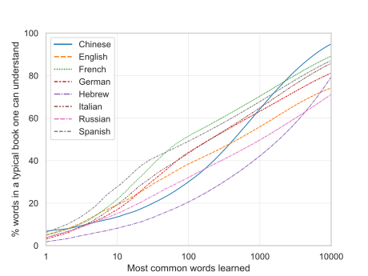

# Google Books n-gram frequency lists

This repository provides lists of the most frequent words and n-grams for all the Google Books corpora that can be searched with the [Google Books Ngram Viewer](https://books.google.com/ngrams/) plus customizable Python code which reproduces these lists. The source data is version 20200217 of the n-gram lists made available by Google [here](https://storage.googleapis.com/books/ngrams/books/datasetsv3.html).

The content of this repository is licensed under the [Creative Commons Attribution 3.0 Unported License](https://creativecommons.org/licenses/by/3.0/).

## Lists with n-grams

The full list of the corpora for which n-gram frequency lists are provided is: English, English Fiction, Chinese (simplified), French, German, Hebrew, Italian, Russian, and Spanish. In the provided lists the corpora are restricted to books published in the years 2010-2019, but in the Python code both this and the number of most frequent n-grams included can be adjusted.

The lists with the most frequent n-grams for each language and n from 1 to 5 are found in the [ngrams](ngrams) directory. For almost all languages cleaned lists are provided for the

- 10.000 most frequent 1-grams, 
- 5.000 most frequent 2-grams, 
- 3.000 most frequent 3-grams, 
- 1.000 most frequent 4-grams,
- 1.000 most frequent 5-grams.

The one exception is Hebrew for which, due to the small corpus size, only the 200 most frequent 4-grams and 80 most frequent 5-grams are provided. 

All cleaned lists also contain the number of times each n-gram occurs in the corpus (its frequency, column `freq`). For 1-grams (words) there are two additional columns: 

1. `cumshare` which for each word contains the cumulative share of all words in the corpus made up by that word and all more frequent words. 
2. `en` which contains the English translation of the word obtained using the Google Cloud Translate API (only for non-English languages).

The lists found directly in the [ngrams](ngrams) directory have been cleaned and are intended for use when developing language-learning materials. The sub-directory [ngrams/more](ngrams/more) contains uncleaned and less cleaned versions which might be of use for e.g. linguists:

- the most frequent raw n-grams as Google stores them (suffixed `0_raw`),
- only keeping entries without part-of-speech (POS) tags (suffixed `1a_no_pos`),
- only keeping entries with POS tags (only for 1-grams, suffixed `1b_with_pos`),
- entries excluded from the final cleaned lists (suffixed `2_removed`).

## Using this when learning languages

To provide some motivation for why leaning the most frequent words first may be a good idea when learning a language, the following graph is provided.

<picture>
  <source media="(prefers-color-scheme: dark)" srcset="graph_1grams_cumshare_rank_dark.svg" width="100%">
  <source media="(prefers-color-scheme: light)" srcset="graph_1grams_cumshare_rank_light.svg" width="100%">
  
</picture>

For each language, it plots the frequency rank of each 1-gram (i.e. word) on the x-axis and the `cumshare` on the y-axis. So, for example, after learning the 1000 most frequent French words, one can understand more than 70% of all words, counted with duplicates, occuring in a typical book published between 2010 and 2019 in version 20200217 of the French Google Books Ngram corpus.

## Python code

The code producing everything is in the [python](python) directory. Each .py-file has a settings section at the top and additional cleaning settings can be specified using the files in [python/extra_settings](python/extra_settings).

### Reproducing everything

Optionally, start by running [create_source_data_lists.py](python/create_source_data_lists.py) from the repository root directory to recreate the [source-data](source-data) folder with lists of links to the Google source data files.

Run [download_and_extract_most_freq.py](python/download_and_extract_most_freq.py) from the repository root directory to dowload each file listed in [source-data](source-data) (a ".gz-file") and extract the most frequent n-grams in it into a list saved in `ngrams/more/{lang}/most_freq_ngrams_per_gz_file`. To save computer resources each .gz-file is immediately deleted after this. Since the lists of most frequent n-grams per .gz-file still take up around 36GB with the default settings, only one example list is uploaded to Github: [ngrams_1-00006-of-00024.gz.csv](ngrams/more/english/most_freq_ngrams_per_gz_file/ngrams_1-00006-of-00024.gz.csv). No cleaning has been performed at this stage, so this is how the raw data looks.

Run [gather_and_clean.py](python/gather_and_clean.py) to gather all the n-grams into lists of the overall most frequent ones and clean these lists by excluding unwanted n-grams.

Run [google_cloud_translate.py](python/google_cloud_translate.py) to add English translations to all non-English 1-grams using the Google Cloud Translate API (this requires an API key, see the file header). By default only 1-grams are translated and only to English, but by changing the settings any n-gram can be translated to any language supported by Google. Google randomly capitalizes translations so an attempt is made to correct for this. Moreover, a limited number of manual corrections are applied using [manual_translations_1grams.csv](python/extra_settings/manual_translations_1grams.csv).

Finally, [graph_1grams_cumshare_rank.py](python/graph_1grams_cumshare_rank.py) produces [graph_1grams_cumshare_rank_light.svg](graph_1grams_cumshare_rank_light.svg) and its dark version.

### Cleaning steps performed

All the cleaning steps are performed in [gather_and_clean.py](python/gather_and_clean.py), except the cleaning of the Google translations.

The following cleaning steps are performed programmatically: 

1. part-of-speech (POS) tags are removed
2. _1-grams, French and Italian_: contractions are split
3. trailing "_" is removed
4. capitalized and uncapitalized n-grams are merged
5. n-grams consisting of only punctuation and/or numbers are removed
6. _1-grams, German_: words containing only uppercase letters are removed unless in the manually created list of exceptions [upcases_to_keep.csv](python/extra_settings/upcases_to_keep.csv)
7. _1-grams, except German_: words starting with an uppercase letter are removed unless in the manually created lists of exceptions [upcases_to_keep.csv](python/extra_settings/upcases_to_keep.csv)
8. _1-grams_: one-character words are removed unless in the manually created lists of exceptions [onechars_to_keep.csv](python/extra_settings/onechars_to_keep.csv)
9. _German and Russian_: contractions are removed
10. _English fiction_: remove n-gram if starting with `"'"`
11. n-grams with non-word characters other than `"'"`, `" "`, and `","` are removed
	- additionally other than `"-"` for Russian and `"\""` for Hebrew
12. n-grams with numbers are removed
13. n-grams in the wrong alphabet are removed.

Moreover, the following cleaning steps have been performed manually, using the English translations to help inform decisions: 

14. _1-grams, all languages_: The lists of removed words have been checked for words wrongly removed.
15. _1-grams, except Hebrew_: The cleaned lists have been fully checked for extra words to exclude. 
16. _1-grams, Hebrew_: The cleaned lists have been checked for extra words to exclude up to rank 100.
17. When n-grams wrongly included or excluded were found during the manual cleaning steps above, this was corrected for by either adjusting the programmatic rules, or by adding them to one of the lists of exceptions, or by adding them to the final lists of extra n-grams to exclude.
18. n-grams in the manually created lists of extra n-grams to exclude have been removed. These lists are in [python/extra_settings](python/extra_settings) and named `extra_{n}grams_to_exclude.csv`.

When manually deciding which words to exlude the following rules were applied. _Exclude_: person names (some exceptions: Jesus, God), city names (some exceptions: if differ a lot from English and are common enough), company names, abbreviations (some exceptions, e.g. ma, pa), word parts, words in the wrong language (except if in common use). _Do not exlude_: country names, names for ethnic/national groups of people, geographical names (e.g. rivers, oceans), colloquial terms, interjections.

## Limitations and known problems

What remains to be done is completing the final manual cleaning for Hebrew and the cleaning of the lists of n-grams for n > 1. An issue that might be addressed in the future is that some of the latter contain "," as a word. It might also be desirable to include more common abbreviations. Of course, some errors remain. Issue reports and pull requests are welcome.
